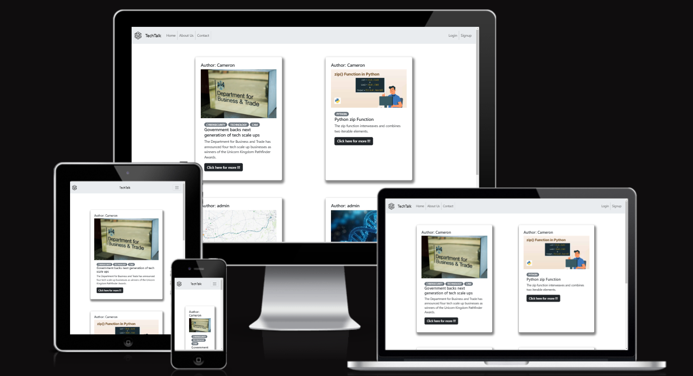
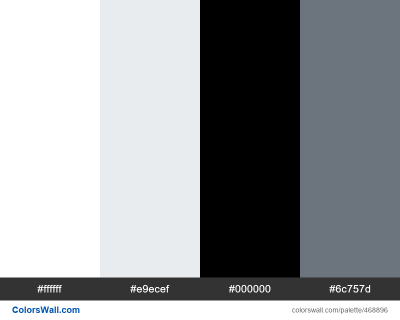
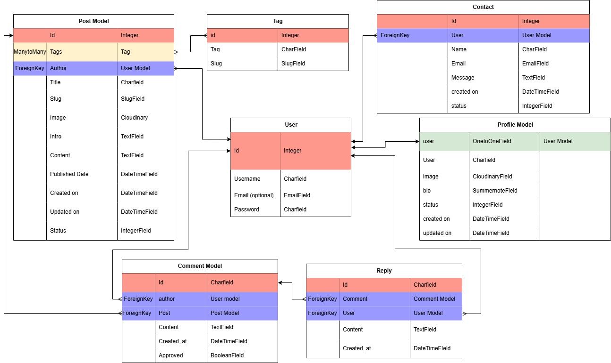

# **TechTalk**

- Techtalk is on online blog where people can make posts about various technology subjects. Techtalk is a place where people can leave comments on those posts to start a conversation about those topics, also having the option to edit and delete posts and contact admin.

- Here is the live version of the website:
[Techtalk](https://techtalk-3a394e241470.herokuapp.com)



## **Contents**

* [Design](#design)
    * [Colours](#colours)
    * [Typography](#typography)
    * [Imagery](#imagery)
* [User Stories](#user-stories)
    * [Users](#users)
    * [Admin](#admin)
* [Agile methodology](#agile-methodology)
* [Wireframes](#wireframes)
* [Features](#features)
    * [Navigation bar](#navigation-bar)
    * [User registration not required](#user-registration-not-required)
    * [User profile creation](#user-profile-creation)
    * [Home page](#home-page)
    * [About us page](#about-us-page)
    * [Contact page](#contact-page)
    * [Profile page](#profile-page)
    * [Create blog post page](#create-blog-post-page)
    * [Users blog post page](#users-blog-post-page)
* [Databse](#database)
* [Defensive Design features](#defensive-design-features)
* [Deployment](#deployment)
    * [Heroku Deployment](#heroku-deployment)
    * [On Heroku](#on-heroku)
    * [Within the codespace](#within-the-codespace)
        * [Procfile](#procfile)
        * [Deployment with a static file](#deployment-with-static-file)
        * [Debug](#debug)
        * [Committing changes](#committing-changes)
    * [Back on Heroku](#back-on-heroku)
* [Automated Testing](#automated-testing)
    * [Blog app](#blog-app)
    * [About app](#about-app)
    * [Contact app](#contact-app)


# Design
## Colours
This colour scheme was considered becuase the contrast between the lighter coloured background and the black text helps the text stand out.

It also is a very minimalistic colour scheme meaning that the content of the blogs stand out a lot more.


## Typography

Trhoughout the project Arial was used but Poppins was imported from google fonts to be used for the contact form.

## Imagery

Static images are used as placeholder images for users profiles and their blog posts if an image hasn't been chosen. The about us page has a static image that is the same image as the the placeholder image for users blog posts.

A map is presented on the contact page to identify Techtalks location.

The remaining imagery is uploaded by users to the database.


# **User Stories**

### **Users**
- As a Site User I want to I can register an account so that I can access the websites features concerning blog posts, comments and reply.

- As a registered user I want  to edit tags on a blog post after publishing it so that I can update or improve the categorization of my content.

- As a registered user I want  to add up to 5 tags to my blog posts so that readers can understand the content of the post before reading.

- As a registered user I want  to send a message to the site admin via email so that I can contact them with questions or concerns.

- As a site user I want to add comments underneath blog posts so that I can share relevant information or my opinions about the blog post.

- As a registered user I want to create blog posts with content and an optional image so that I can share my thoughts and interests with other users.

- As a registered user I want to update my profile image and profile content so that I can keep my information up-to-date.
- As a Site User I want to I can register an account so that I can access the websites features concerning blog posts, comments and reply

- As a registered user I want to reply to comments on blog posts so that I can engage in conversation with other users.

- As a site user I want to view comments and toggle replies under a blog post so that I can follow the conversation and participate if needed.


### **Admin**

- As an admin I want to create, read, update, and delete posts so that I can manage posts in the Admin panel

- As an admin I want to  manage comments in the Admin panel so that I can manage comments on all blog posts

- As an admin I want to  mark emails sent by users as read so that I can keep track of which messages have already been reviewed.

- As an admin I want to  view comments on blog posts so that I can monitor and manage user discussions.

- As an admin I want to create, read, update, and delete Replies so that I can manage replies in the Admin panel

- As a admin I want to  approve or disapprove comments on blog posts so that I can filter out inappropriate comments.

- As a Admin I want to remove approval for comments so that when a user submits a comment it appears under the blog post after being redirected back to the blog post

# Agile methodology
This project was planned using Agile Methodology, specifically utilizing GitHub and its Project Board feature. The Kanban board within GitHub's project view helped to categorize the project tasks into the following sections:


* To Do: Initially, all user stories were placed in this column.

* In Progress: During development, user stories were moved to this column.

* Done: Once development was completed, user stories were transitioned to this column.

* Discarded User Stories to dicard a user story that was no longer being used.

Please find my Kanban Board with my user stories [here](https://github.com/users/Cam-4587/projects/10/views/1).

# Wireframes 
[Wireframes here](/docs/read_me/wireframes.png) 

These wireframes were created with balsamiq.

# Features

## <ins>Navigation bar</ins>

the navigation bar allows users to navigate easily across all pages and the navigation buttons update depending on whether or not the user is logged in or not.

| Nav Link              |Not logged in  |Logged in as user|Logged in as admin
|:-------------         |:------------- |:----------------|:------------- |
|Logo(back to home)     |&#9989;        |&#9989;          |&#9989;
|Home                   |&#9989;        |&#9989;          |&#9989;
|Contact                |&#9989;        |&#9989;          |&#9989;
|My Profile             |&#10060;       |&#9989;          |&#9989;
|Create a Blog post     |&#10060;       |&#9989;          |&#9989;
|Your Blog posts        |&#10060;       |&#9989;          |&#9989;
|Sign Out               |&#10060;       |&#9989;          |&#9989;
|Sign up                |&#9989;        |&#10060;         |&#10060;
|Log In                |&#9989;        |&#10060;         |&#10060;

## <ins>**User registration not required**</ins>

I wanted to give non registered users the ability to search through and read other users blogs and have the ability to contact the admin so that the blog is made more accessible. 

## <ins>**User Profile creation**</ins>

- At the end of the navigation bar and in the about use page there are buttons that can navigate you to the signup page where you enter the following things to create an account:
    + a Username
    + an email address (optional)
    + a Password
    + Password confirmation
- Following the creation of User, a profile instance is created.

Once the user has created an account they can then create/update their own Profile, Create/update their own Posts and add comments and replies to other users posts and comments.

## <ins>Home page</ins>

+ The Home page shows a generic list view of all of the published blogs with a button to take the user to that blog post.

    - Within the blog post view you have the blog contents with a comment section below.
    - The comment section comprises of a comment form and a button to toggle through replies to that comment.
    - If the blog posts author corrosponds to the acitve user then an edit profile page and a delete profile page button will display.
    - if the comment/reply author corrosponds to the user then a delete button for the comment/reply will appear.
    - Usernames displayed next to comments and replies also act as links to a public Profile page that can be viewed by other users.
    - If the user has no profile or it is pending review then it will display "Profile not found".

    <br>

    

## <ims>About us page</ims>

+ The about us page gives a small paragraph of text that acts that introduces the user to the website and what the website is about located next to an image.

+ if the user is not signed up up then a sign up button will appear redirecting the user to the sign up page.

    <br>

    

## <ins>Contact page</ins>

+ The contact page contains a contact form along with a map and contact information.

    - The contact form requires the user to enter a name, email and their contact information.

    - The contact form can be used by both registered and unregistered users so it can be used as boh a way to contact admin for collaboration purposes and to highlight and issues with the content.

    <br>


## <ins>Profile page</ins>

- When a user instance is created the User's username is displayed in the navigation bar where they can go to create their profile.

- The user will first be shown a create profile form where they can upload an image and a bio for other uses to see.

- After submission the profile will be pending review with a message on their profile page saying that their profile is pending review.

- Once the users profile has been reviewed and published it will be visible to the user where they can either delete it or edit their own profile.

## <ims>Create blog post page</ims>

+ Next to the user's profile is a path to create your own blog post.

+ You get redirected to the blog post form where you fill in:
- The blog title
- An image file
- Up to 5 tags to associated your blog post with.
- An introduction secton that will have a maximum of 150 characters
- A summernote field to add the users own blog content.

+ Once the user has submitted their blog post it will be pending review by the admin before it can be published.
+ Once it has been published it can be edited and deleted by the user. 

## <ims>Users blog post page</ims>

+ The registered User has a page that views their own blog posts
+ The posts are organised in a column and are paginated by a factor of 6 blog posts
+ The user has the option to view the blog post as well as to edit or delete their 
own blog posts from this page.


# <ins>Database</ins>
A postgres database was used in the creation of this website. Below shows an image of how the database tables relate to one another. 
<br>




# <ins>Defensive Design Features</ins>

These are the steps I have taken with regards to defensive design:

+ When the User chooses to delete either of the following:
    - A profile page
    - A blog post
    - A comment
    - A reply

    They are taken to a delete form on a separate page where they can either commit to deleting or to going back to the previous page.

+ When the user wants to sign out there is an opton to cancel and go back to the previous page.

+ After a user has created a blog post or made a profile page the profile is submitted but needs to be authenticated by an admin first before it can be published, an alert message appears to tell this to the user.

+ Default images:

- For both blog posts and profiles, the user has an option to upload an image.

- However if the user does not upload an image a default image will be uploaded in its place. 


+ error pages:

- if the user alters the url to direct them to a page that doesn't exist then they will be displayed with a page that will display
 "<strong>Not Found</strong> The requested resource was not found on this server."

# Deployment

## Heroku Deployment

This project was deplpyed using Heroku.


### On Heroku

+ Log into Heroku
+ Select 'Create New App' from your dashboard, choose an app name and select the appropriate region.
+ Click 'Create App'
+ Select 'Settings' on the navigation mendu and In Config vars, add key/values conferring to configuration settings, environment variables, and other key-value pairs related to the Python project. 
+ Also in Config vars add the key value pair <strong>DISABLE_COLLECTSTATIC: 1</strong> for deployment wihout static files.


### Within the codespace

#### Procfile

+ Install the gunicorn python package and freeze to requirements.txt.

+ Create a file called 'Procfile' and add the following command ``` web gunicorn techtalk.wsgi ``` .

#### Deployment with static file

+ The whitenoise python package was installed and added to requirements.txt

+ In settings.py add whitenoise middleware to middleware and add a static root path to 'staticfiles'.

+ Enter the command ``` python3 manage.py collectstatic ``` into the terminal.

+ Create the file 'runtime.txt' and add a supported runtime from [supported runtimes](https://devcenter.heroku.com/articles/python-support#specifying-a-python-version).


#### Debug

+ Set debug to False on settings.py

#### Committing changes

+ git add. , commit and push the changes with and appropriate commit message such as "prepare oriject for deployment"

### Back on Heroku

(optional) select 'Resources' on the navigation menu and enable Eco Dynos

+ Back on Heroku in 'Config Vars' remove the <strong>DISABLE_COLLECTSTATIC : 1</strong> key/value pair. 
+ Select 'Deploy' on the navigation menu and in the 'Deployment method' section select Github, enter your repository and select 'Connect'.
+ At the bottom of the page in the Manual deploy section click 'manual deploy' and once it has finshied loading select 'open app'.


# Automated Testing

Automated Unit Testing was carried out with Djangos testing tools and written to cover as much of the site as possible. Below is an overview of each app and what was tested:

### Blog app

+ Forms
    - ```test_form_is_valid``` was used to test the ```commentForm```with the content "This is a comment to the post" and ```self.assertTrue``` asserts whether the form is valid.
    - ```test_form_is_invalid``` was used to test if the ```commentForm``` with an empty string is invalid.It uses ```self.assertFalse``` to assert that the form is invalid.
    - ```test_form_is_valid``` was used to test the ```replyForm``` with the content "This is a reply to the comment." and ```self.assertTrue``` asserts whether the form is valid.
    - ```test_form_is_invalid``` was used to test if the ```replyForm``` with an empty string is invalid.It uses ```self.assertFalse``` to assert that the form is invalid.

+ Views

    - setUp: This method sets up the test environment by creating a superuser, logging in, and creating a blog post with the title "Blog title".

    - test_render_post_blog_page: This test checks if the blog post page is rendered correctly. It verifies the following:
        - The HTTP status code of the response is 200.
        - The response content includes "Blog title", "blog-title", and "Blog content".
        - The correct template "blog/post_blog.html" is used.
        - The context contains instances of CommentForm and ReplyForm.
        - Test for Successful Comment Submission

    - Test for Successful Comment Submission
        - test_successful_comment_submission: This test checks if a comment can be successfully submitted. It performs the following steps:
        - Creates a blog post.
        - Logs in with a user.
        - Posts a comment.
        - Checks if the response redirects to the blog post page with status code 302.
    - Test for Successful Reply Submission
        - test_successful_reply_submission: This test checks if a reply to a comment can be successfully submitted. It performs the following steps:
        - Creates a comment on a blog post.
        - Logs in with a user.
        - Posts a reply.
        - Checks if the response redirects to the blog post page with status code 302.
        - These tests ensure that the blog post page renders correctly and that comments and replies can be submitted successfully.

# About app
+ Forms

    - UpdateProfileFormTest: 
        - This test case verifies the functionality of the UpdateProfileForm.
        - Test for successful Profile form submission: ```test_form_is_invalid```: This test checks if the form is valid when provided with valid data and a file upload. It ensures that the form can handle the input properly and is considered valid.

+ Views
    - setUp: This method prepares the test environment by creating a superuser.
    - UpdateFormViewTest:
        -  This test case verifies the views related to updating and deleting user profiles.

    - Test for updating profile and redirecting back to profile page:
        - test_successful_profile_update: This test logs in a user, submits valid profile data via a POST request, and checks if the response redirects to the correct profile page URL.

    - Test for deleting profile and redirecting back to user's profile page:
        - test_successful_profile_delete: This test logs in a user, performs a POST request to delete the profile, and verifies that the response redirects to the correct profile page URL. It also checks that the profile's bio is empty and the image is set to "nobody" after deletion.
# Contact app
+ Form
    -  test_form_is_valid: Verifies that the form is valid when all fields (name, email, message) are provided.
    - test_form_is_invalid_without_name: Ensures the form is invalid when the name field is empty.
    - test_form_is_invalid_without_email: Ensures the form is invalid when the email field is empty.
    - test_form_is_invalid_without_message: Ensures the form is invalid when the message field is empty.
