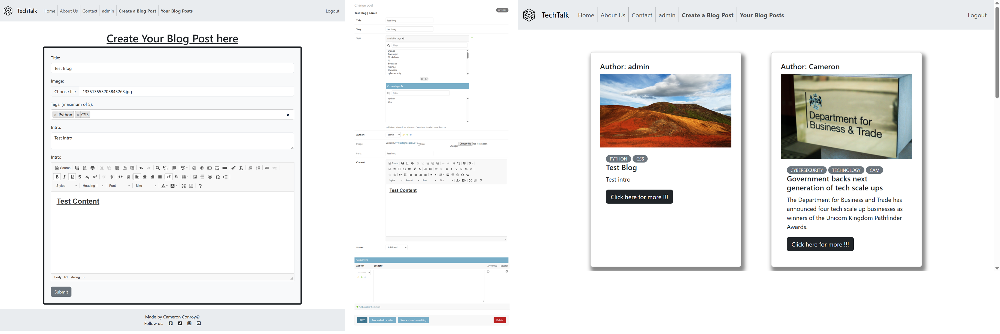
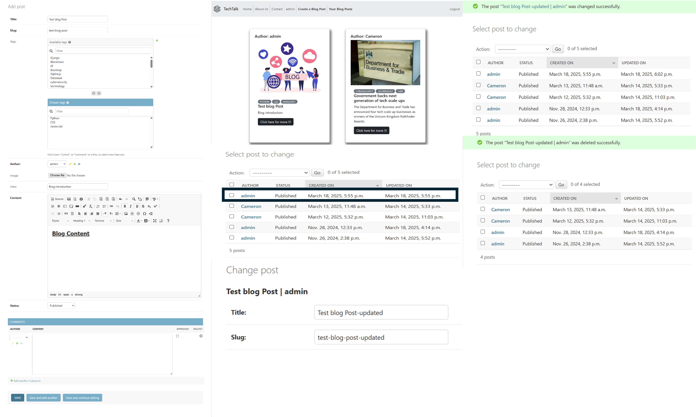
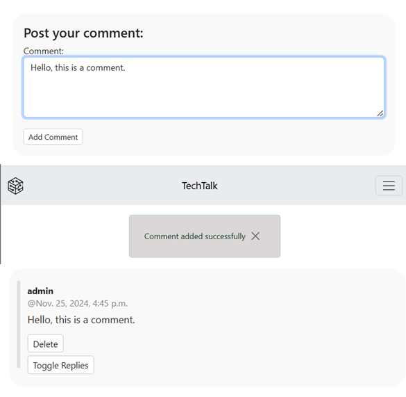

* [Testing from User Stories](#testing-from-user-stories)
* [Automated Testing](#automated-testing)
    * [Blog app](#blog-app)
    * [About app](#about-app)
    * [Contact app](#contact-app)
* [Responsive Design](#responisve-design)

## Testing from User Stories
### Users 
* As a Site User I want to  register an account so that I can access the websites features concerning blog posts, comments and reply.


* As a registered user I want  to edit tags on a blog post after publishing it so that I can update or improve the categorization of my content.


* As a registered user I want to add up to 5 tags to my blog posts so that readers can understand the content of the post before reading.


* As a registered user I want  to send a message to the site admin via email so that I can contact them with questions or concerns.


+  As a site user I want to add comments underneath blog posts so that I can share relevant information or my opinions about the blog post.


+  As a registered user I want to create blog posts with content and an optional image so that I can share my thoughts and interests with other users.

+  As a registered user I want to update my profile image and profile content so that I can keep my information up-to-date.


+ As a registered user I want to reply to comments on blog posts so that I can engage in conversation with other users.

+ As a site user I want to view comments and toggle replies under a blog post so that I can follow the conversation and participate if needed.


### **Admin**

- As an admin I want to create, read, update, and delete posts so that I can manage posts in the Admin panel

- As an admin I want to  manage comments in the Admin panel so that I can manage comments on all blog posts

- As an admin I want to  mark emails sent by users as read so that I can keep track of which messages have already been reviewed.

- As an admin I want to  view comments on blog posts so that I can monitor and manage user discussions.

- As an admin I want to create, read, update, and delete Replies so that I can manage replies in the Admin panel


- As a Admin I want to remove approval for comments so that when a user submits a comment it appears under the blog post after being redirected back to the blog post [<code style="color : red">Redacted</code>]

- As a Admin I want to remove approval for comments so that when a user submits a comment it appears under the blog post after being redirected back to the blog post.




## Manuel Testing

## Manually Testing Functionality
### **Navigation**

|Element               |Action|Expected Result               |Pass/Fail|
|:-------------         |:----|:----------------------------------|:---|
| **NavBar**            |                                         |    |
|Site Name (logo area)  |Click|Redirect to home page                   |Pass|
|Site Name   |Click|Redirect to home page                  |Pass|
|About us page |Click|Redirect to About us page                  |Pass|
|Contact |Click|Redirect to Contact page                   |Pass|
|Creating a blog post  |Click| Redirect to Blog post form                   |Pass|
|Username  |Click|Redirect to Profile                   |Pass|
|Logout  |Click|Redirect to home  with sign out message                 |Pass|
|Sign out  |Click|Redirect to Logout page                  |Pass|
|Login |Click|Redirect  to Login page                  |Pass|
|Sign up |Click|Redirect to Sign up page                  |Pass|
| **Sign out page**            |                                         |    |
|Sign Out  |Click|Redirect to home  with sign out message                 |Pass|
|No, Cancel  |Click|Redirect back to previous page               |Pass|
| **Login page**|
| Sign in |Click|Redirect to home page with sign in message                 |Pass|
| **Home page**|
| "Click here for more!!!" |Click|Redirects to the blog post                 |Pass|
| Next |Click|Redirects to next page of blog posts                 |Pass|
| Previous |Click|Redirects to Previous page of blog posts                 |Pass|
| **Blog page**|
|Add comment |Click |Redirects user back to blog post with comment | Pass|
|Add comment (empty string) |Click |User is prompted to enter content | Pass |
|Delete (comment)|Click|Redirects user to comment delete page| Pass|
|Toggle Replies|Click |Opens reply section |Pass|
|Submit (reply)|Click |Redirects user back to delete comment page | Pass|
|Submit reply (empty string) |Click |User is prompted to enter content | Pass |
|Delete (reply)|Click |Redirects user to delete reply page | Pass|
|Edit post |Click|Redirects user to edit post page| Pass|
|Delete (post)| Click| Redirects user to delete post page| Pass|
|Username in comments section| Click| Redirects to User's Profile page|Pass|
| **Blog Post delete page**|
|Yes, delete |Click |Redirects user back to home page with blog deleted | Pass|
|No, Cancel |Click |Redirects user back to blog post | Pass|
| **Blog Post Creation page**|
|Submit |Click |Redirects user back to Profile page with edited content | Pass|
|Submit (empty title or content section) |Click |User is prompted to enter content| Pass|
|Submit (more than 5 tags selected) |Click |User is informed that there is an invalid number of tags| Pass|
| **Blog Post Editing page**|
|Submit |Click |Redirects user back to Blog post with edited content | Pass|
|Submit (empty title or content section) |Click |User is prompted to enter content| Pass|
|Submit (more than 5 tags selected) |Click |User is informed that there is an invalid number of tags| Pass|
| **Comment delete page**|
|Yes, delete |Click |Redirects user back to Blog post with comment deleted | Pass|
|No, Cancel |Click |Redirects user back to blog post | Pass|
| **Reply delete page**|
|Yes, delete |Click |Redirects user back to Blog post with reply deleted | Pass|
|No, Cancel |Click |Redirects user back to blog post | Pass|
| **Profile delete page**|
|Yes, delete |Click |Redirects user back Create profile form | Pass|
|No, Cancel |Click |Redirects user back to Profile page | Pass|
| **Profile Editing page**|
|Submit |Click |Redirects user back to Profile page with edited content | Pass|
|Submit(empty text content) |Click |User is prompted to enter content|Pass|
| **About Us page**|
|Sign up |Click |Redirects user back to Sign up page | Pass|
| **Contact page**|
|Submit |Click |Redirects user back to Contact page with confirmation messagw | Pass |
|Submit (any field being empty or inavlid email field) |Click |User is prompted to enter content in the write format.|Pass|


## Automated testing

Automated Unit Testing was carried out with Djangos testing tools and written to cover as much of the site as possible. Below is an overview of each app and what was tested:

### Blog app

+ Forms
    - ```test_form_is_valid``` was used to test the ```commentForm```with the content "This is a comment to the post" and ```self.assertTrue``` asserts whether the form is valid.
    - ```test_form_is_invalid``` was used to test if the ```commentForm``` with an empty string is invalid.It uses ```self.assertFalse``` to assert that the form is invalid.
    - ```test_form_is_valid``` was used to test the ```replyForm``` with the content "This is a reply to the comment." and ```self.assertTrue``` asserts whether the form is valid.
    - ```test_form_is_invalid``` was used to test if the ```replyForm``` with an empty string is invalid.It uses ```self.assertFalse``` to assert that the form is invalid.

+ Views

    - setUp: This method sets up the test environment by creating a superuser, logging in, and creating a blog post with the title "Blog title".

    - test_render_post_blog_page: This test checks if the blog post page is rendered correctly. It verifies the following:
        - The HTTP status code of the response is 200.
        - The response content includes "Blog title", "blog-title", and "Blog content".
        - The correct template "blog/post_blog.html" is used.
        - The context contains instances of CommentForm and ReplyForm.
        - Test for Successful Comment Submission

    - Test for Successful Comment Submission
        - test_successful_comment_submission: This test checks if a comment can be successfully submitted. It performs the following steps:
        - Creates a blog post.
        - Logs in with a user.
        - Posts a comment.
        - Checks if the response redirects to the blog post page with status code 302.
    - Test for Successful Reply Submission
        - test_successful_reply_submission: This test checks if a reply to a comment can be successfully submitted. It performs the following steps:
        - Creates a comment on a blog post.
        - Logs in with a user.
        - Posts a reply.
        - Checks if the response redirects to the blog post page with status code 302.
        - These tests ensure that the blog post page renders correctly and that comments and replies can be submitted successfully.

### About app
+ Forms

    - UpdateProfileFormTest: 
        - This test case verifies the functionality of the UpdateProfileForm.
        - Test for successful Profile form submission: ```test_form_is_invalid```: This test checks if the form is valid when provided with valid data and a file upload. It ensures that the form can handle the input properly and is considered valid.

+ Views
    - setUp: This method prepares the test environment by creating a superuser.
    - UpdateFormViewTest:
        -  This test case verifies the views related to updating and deleting user profiles.

    - Test for updating profile and redirecting back to profile page:
        - test_successful_profile_update: This test logs in a user, submits valid profile data via a POST request, and checks if the response redirects to the correct profile page URL.

    - Test for deleting profile and redirecting back to user's profile page:
        - test_successful_profile_delete: This test logs in a user, performs a POST request to delete the profile, and verifies that the response redirects to the correct profile page URL. It also checks that the profile's bio is empty and the image is set to "nobody" after deletion.
### Contact app
+ Form
    -  test_form_is_valid: Verifies that the form is valid when all fields (name, email, message) are provided.
    - test_form_is_invalid_without_name: Ensures the form is invalid when the name field is empty.
    - test_form_is_invalid_without_email: Ensures the form is invalid when the email field is empty.
    - test_form_is_invalid_without_message: Ensures the form is invalid when the message field is empty.

# Responisve design
TechTalk has been tested for responsiveness on the following devices:

* Iphone SE
* Iphone XR
* Iphone 12 Pro
* Iphone 14 Pro max
* Pixel 7
* SamSung Galaxy s8+
* Samsung Galaxy s20  Ultra
* Ipad Mini
* Ipad Air
* Ipad Pro
* Surface Pro 7
* Surface Duo
* Galaxy Z Fold 5
* Asus Zenbook Fold
* Samsung Galaxy A51/71
* Nest Hub
* Nest Hub Max